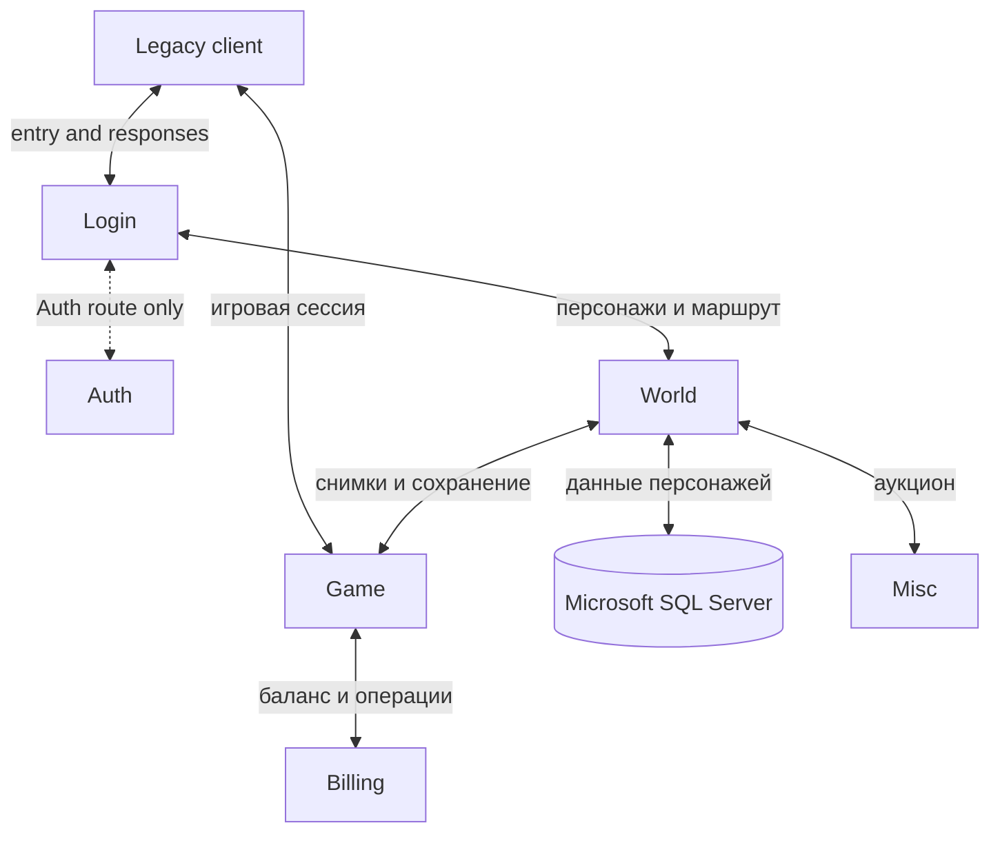
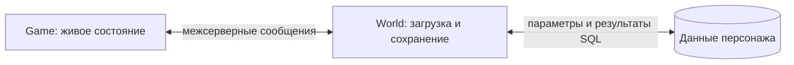

# Обзор архитектуры / Architecture tour

**English summary.** Six Rust/Linux executables preserve the legacy service boundaries. Login coordinates entry, Auth handles the corresponding authentication route, World loads and persists characters, and Game owns live regional simulation. Billing handles account operations; Misc handles auctions. The diagram is a responsibility map, not a claim that every route has passed a client scenario.

## Шесть служб, разные жизненные циклы

Здесь описана текущая шестипроцессная реализация. Для её рефакторинга принята [компонентная структура Realm, Zone и Shared](../architecture/realm-and-zone.md); она определяет новые границы и не требует сохранять историческое число процессов. Следующая диаграмма показывает существующие связи.

Диаграмма показывает основные связи обмена, а не порядок установки TCP-соединений. Пунктир к Auth обозначает условный маршрут. В частности, Auth — один из путей проверки Login, а не обязательный шаг любой ветви: существуют GAS и другие маршруты. SQL используется также профильными DB-модулями служб; изображённый путь World не означает исключительное владение всеми таблицами БД.

| Служба | Что важно понимать новичку | Где изучать подробно |
| --- | --- | --- |
| Login | Вход ещё не является игровой сессией: клиент ожидает результаты других служб. | [Вход и службы](../server/auth-login-and-services.md) |
| Auth | Проверяет учётную запись в выбранном маршруте и возвращает результат ожидающему Login. | [Протокол входа](../protocol/login-auth.md) |
| World | Связывает персонажа с мировыми данными, БД и игровым процессом. | [World и Game](../server/world-and-game.md) |
| Game | Последовательно меняет живые объекты региона и публикует клиентские изменения. | [Симуляция](../gameplay/simulation.md) |
| Billing | Ведёт баланс и связанные операции. | [Аукцион и платежи](../gameplay/auction-and-payments.md) |
| Misc | Обслуживает аукцион через обмен с World. | [Службы](../server/auth-login-and-services.md) |

## Где живёт состояние

Game владеет региональным состоянием во время игры. World загружает и сохраняет мировую проекцию персонажа. Передача между ними — явная граница: снимок, очередь, обработчик и результат записи могут относиться к разным моментам времени. Поэтому успешная отправка сообщения не доказывает сохранение, а поздняя ошибка не отменяет уже выполненные эффекты.

При добавлении сохраняемого поля нужно согласовать живой объект, передаваемый формат, чтение и запись. Подробные правила и ссылки на код остаются в [основном документе о владении состоянием](../architecture/state-ownership.md), [сохранении](../architecture/persistence.md) и [БД](../architecture/database.md).

## Современная инфраструктура и старые контракты

Один Rust-пакет предоставляет шесть бинарников с общими модулями, но каждый процесс создаёт своё состояние. Tokio обслуживает сеть и задачи; очереди сохраняют точки исполнения доменных операций. Tiberius заменяет ADO для SQL Server. Совместимость требует учитывать направление кадра, порядок полей, знаковость, переполнение, кодировки, таймеры и частичные эффекты — не только имена функций.

Продолжение знакомства: [путь игрока](player-journey.md) → [текущий статус](status.md). Для работы с реализацией: [карта кода](../architecture/workspace.md) и [общие механизмы](../architecture/shared-mechanisms.md).
