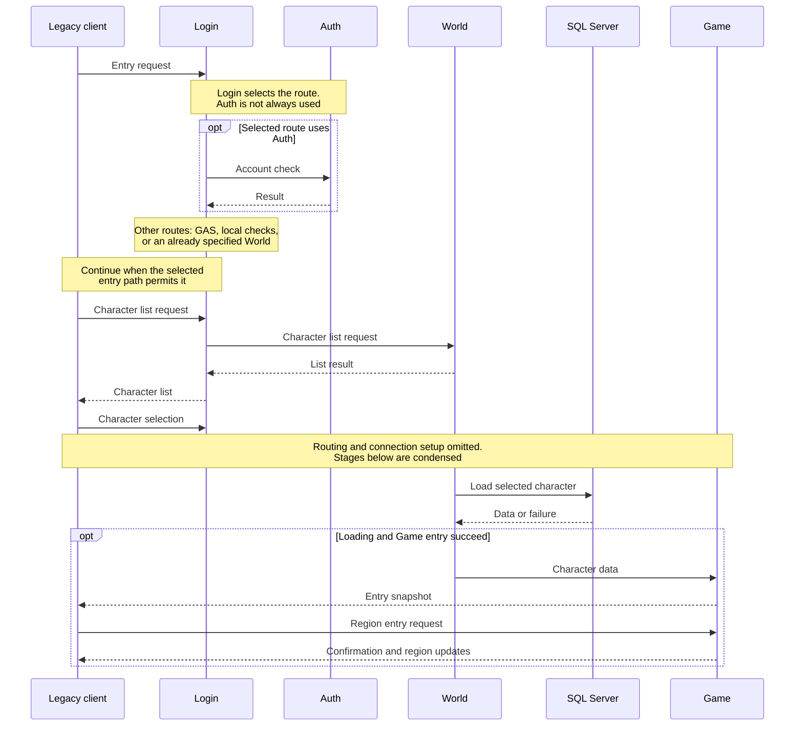

# Путь игрока / Player login journey

**English summary.** Entry crosses several service boundaries: Login selects an entry or authentication route, World retrieves character data, Game creates the live player and sends a client snapshot, and a subsequent client request enters the region. Loading a character is not proof that the client reached a stable playable world. Detailed packet layouts remain in the linked protocol specifications.

Это схема этапов, а не полная временная трасса одного TCP-сеанса: список, выбор, перенаправление и повторный вход имеют разные ветви и ошибки. Auth не обязателен для всех маршрутов. Точные условия соединений и сообщений находятся в [Login/Auth](../protocol/login-auth.md), [входе Game](../protocol/game-login.md) и [каталоге opcode](../protocol/opcode-catalog.md).

## Что происходит на границах

1. **Клиент до игрового мира.** Login сохраняет связь ожидающего запроса с результатом проверки. Потеря этой связи не исправляется простым повтором пакета: важны состояние соединения и очередь.
2. **Выбор персонажа.** World разрешает персонажа и читает данные через DB-модули. Успешный список ещё не подтверждает пригодность полного игрового снимка.
3. **Создание живого игрока.** Game проверяет маршрут и идентификатор, читает `GameSave`, создаёт игрока и готовит клиентский снимок. После его постановки следует запрос баланса к Billing; постановка в очередь не подтверждает доставку.
4. **Вход в регион.** Ответ со снимком и запрос региона — разные сообщения. После размещения Game публикует подтверждение, погоду и соседей. Одна неправильная длина поля в снимке может сдвинуть дальнейший разбор у клиента.
5. **Игровая сессия и выход.** Движение, изменения объектов и последующее сохранение требуют собственных наблюдений. Регистрация игрока в Game не подтверждает ни стабильный кадр игры, ни успешное сохранение после выхода.

Распределение обязанностей описано во [владении состоянием](../architecture/state-ownership.md); длительный жизненный цикл — в [персонаже](../gameplay/player-lifecycle.md), размещение — в [регионах](../gameplay/regions-and-visibility.md).

## Достигнутый результат

На этом пути наблюдались список персонажей, загрузка, регистрация игрока в Game и короткое непрерывное движение после исправлений; устойчивый игровой сеанс пока не подтверждён. Следующая страница — [текущий статус](status.md): она отделяет достигнутые этапы от следующих проверок. [Case study](../reconstruction/case-study-region-entry.md) показывает разбор одного контракта, а [подробный аудит](../status/audit.md#runtime-проверка-game-ai-2122-сентября) хранит наблюдения.
