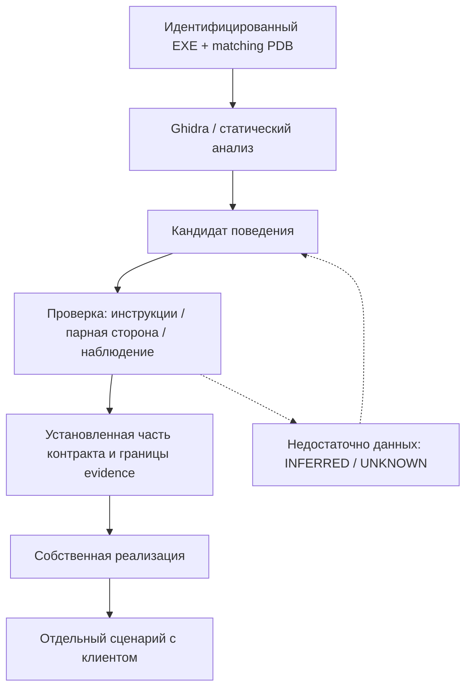

# Как восстанавливается поведение / Reconstruction methodology

**English summary.** Identify the binary and matching PDB, locate candidate behavior with Ghidra, then resolve ambiguity using machine instructions, the peer implementation, or a reproducible runtime observation. Decompiler output alone does not prove a contract. Public results are authored implementations, specifications, and provenance metadata; full raw output and original materials remain private local evidence.

## От материала к утверждению

Matching EXE/PDB означает, что отладочные символы относятся именно к исследуемой сборке: для используемых PDB сверяются идентификатор и age из debug-записи EXE и самого PDB. SHA-256 позволяет идентифицировать файл, но сам по себе не устанавливает соответствие EXE и PDB. Адреса, layout и поведение нельзя переносить между сборками без основания. Декомпилят может неверно восстановить тип, порядок вычислений, знаковость или границы функции; особенно важны [неоднозначные места](evidence-and-contracts.md#обязательная-проверка-неоднозначных-мест).

Оригинальный процесс может служить поведенческим эталоном: записываются условия, вход, наблюдаемые эффекты и ограничения. Поведение клиента и сравнение протокола помогают проверить читающую сторону. Packet capture — локальный источник наблюдений, а не готовое публичное вложение: он может содержать учётные и пользовательские данные. В документацию попадают обезличенный контракт, воспроизводимые условия и выводы.

## Статусы

Основные определения и достаточность оснований заданы в [правилах свидетельств](evidence-and-contracts.md). Кратко: `VERIFIED` имеет прямое основание в заявленной области; `PARTIAL` покрывает лишь часть контракта; `INFERRED` обозначает обоснованный вывод без достаточного прямого подтверждения; `UNKNOWN` явно сохраняет пробел. Утверждение относится к конкретной сборке и границе. Evidence — наблюдаемый или непосредственно проверенный источник; inference — вывод из косвенных оснований. Неизвестные поля и ветви называются явно и не заполняются догадкой ради законченной реализации. Статус реконструкции нельзя подменять результатом компиляции или наоборот.

## Что распространяется

RAW имеет известное происхождение: EXE/PDB → Ghidra/decompiler → исследовательский pseudocode → анализ → реконструкция. Полный вывод и оригинальные файлы хранятся локально. В публичном дереве сохраняются собственная реализация, спецификации, структуры, opcodes, формулы, описание поведения и полезные метаданные: SHA-256, matching metadata, функция, адрес/RVA и статус.

Некоторые файлы содержат только карточки исследованных функций: это каталог границ знания, а не исполняемый код. `PROTOTYPE` в исторической карточке обозначает предположение декомпилятора, а не автоматически подтверждённую сигнатуру. Не реализованные функции остаются неизвестными; удаление полного RAW из поставки не повышает их статус. [Идентификация сборок](../../server/rust/src/manifest/) сохранена отдельно от полного экспорта.

Собственные объяснения в верхних комментариях и на страницах подсистем сохраняют уже сформулированные знания. Если анализ RAW впервые даёт полезный вывод, его нужно записать своими словами в основной спецификации с основанием и пределом уверенности. Не переносите псевдокод в публичную документацию под видом собственного вывода.

Пример: [вход в регион](case-study-region-entry.md). Источники и локальная структура — в [материалах анализа](sources.md); общие наблюдения запусков — в [аудите](../status/audit.md).
