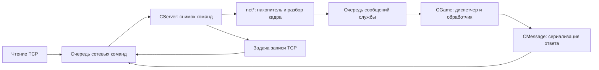

# Как сеть передаёт работу серверу

Сетевой runtime превращает TCP-поток в упорядоченные действия службы. Он разделяет ожидание сокета, разбор кадра и изменение прикладного состояния: готовность TCP ещё не означает готовое сообщение, а готовое сообщение ещё не означает выполненную операцию. Это разделение позволяет использовать Tokio, сохраняя собственные очереди и порядок обработки.

Здесь описан текущий Rust-код. Точные результаты сборки и совместного запуска с границами проверки находятся в [состоянии проекта](../status/audit.md#совместный-запуск-20-сентября-2026). Байты и числовые ограничения — в [протоколе](../protocol/README.md), порядок тактов — в [серверных циклах](runtime-ordering.md), запуск процесса — в [модели процессов](process-model.md).

Рекомендации по расширению опираются на [ADR-0007](../decisions/0007-reuse-existing-mechanisms.md): при одинаковых требованиях используется существующий механизм. Описание ниже показывает его фактические границы. Несколько `CMessage`, разные формы снятия очередей и локальные таймеры — текущее устройство, а не требование повторять эти различия в новой функции. Общая карта средств — [повторное использование](../architecture/shared-mechanisms.md).

## Кто владеет соединением

У принятого соединения есть два вида состояния. `TcpStream` обслуживает ОС, а `CServerClient` хранит накопленные входные и выходные байты, socket ID, назначенную identity, счётчики и флаги закрытия. Оба принадлежат записи `AcceptedServerClient` в `CServer`. Задачам I/O передаётся `Arc<TcpStream>`; изменять реестры соединений они через этот дескриптор не могут.

`CServer` хранится внутри сетевого компонента службы; кто выполняет его проходы, определяет runtime этой службы. Только обработка `CServer::process_command_snapshot` применяет опубликованные сетевые команды. Обработчику или фоновому работнику достаточно клона `ServerCommandHandle`: он копирует байты и ставит `SendToSocket`, `SetMapId`, `QuitBySocketId` и другие команды. Такой интерфейс позволяет ответить из DB-потока без общего `Arc<Mutex<CGame>>`. Реализация — [CServer и команды](../../server/rust/src/nets/servers.rs), [состояние принятого клиента](../../server/rust/src/nets/serverclient.rs).

У World принятые Game-соединения обслуживает отдельная Tokio-задача с `WorldServerNetworkRuntime`. Переданный ей клон [world_server.rs](../../server/rust/realm/src/app/world_server.rs) разделяет с доменным владельцем один `Arc<parking_lot::Mutex<CServer>>` и прежнюю FIFO `WorldServerEvent`. Блокировка охватывает синхронные операции с `CServer`, включая разбор сетевого снимка; она освобождается до `await` и запуска I/O-действий. Callbacks публикуют сообщения и события закрытия в FIFO; её по-прежнему разбирает World `CGame::process_message`, которому принадлежат доменные данные.

Так сеть может обслуживать отправку во время длительной подготовки начальной конфигурации в `CGame`. Причина выделения задачи зафиксирована в [ADR-0002](../decisions/0002-semantic-boundary.md); период, исходящий Login-путь и остановка задачи — в [порядке циклов](runtime-ordering.md#сетевые-проходы-world-и-game). Реализация — [World runtime](../../server/rust/src/worldserver/worldserver/runtime.rs).

Исходящее соединение устроено иначе. Конкретный `CMyNetClient` владеет `Option<TcpStream>`, накопителем, очередью отправки и очередью принятых сообщений. Общий [clients.rs](../../server/rust/src/nets/clients.rs) предоставляет connect, `ClientSendQueue` и счётчики, но не единый объект, который управлял бы reconnect всех служб. Например, [Login→Auth](../../server/rust/src/nets/netlogin/mynetclient_auth.rs) и [Misc→World](../../server/rust/realm/src/app/misc_client.rs) имеют собственные события закрытия и методы `run_io_once`.

## Один запрос: от TCP до ответа

Эта схема относится к **принятому** соединению. После `ADD` runtime запускает один последовательный `ServerIoAction::Receive`. Задача публикует прочитанные фрагменты в очередь команд. Она не вызывает игровой обработчик. При следующем сетевом проходе команда `Receive` добавляет байты в накопитель и вызывает `ServerComponentCallbacks::on_receive` конкретного направления.

Парсер извлекает полные кадры, проверяет их по правилам направления, создаёт `CMessage` и переносит в него метаданные соединения. Доменная очередь получает владеющий объект сообщения. Если TCP принёс половину кадра, объект ещё не создаётся; если несколько кадров — объекты публикуются последовательно. Повреждение позднего кадра не отменяет сообщения, уже опубликованные из того же чтения.

Когда `CGame` достигает стадии сообщений, он извлекает очередную порцию и запускает диспетчер. Ответ сериализуется и ставится в сетевую очередь. Если это произошло после снятия сетевого снимка, новая команда отправки попадёт в следующий сетевой проход. Поэтому успешный результат `send_*` обычно означает постановку команды, а не запись в сокет или получение ответа адресатом.

У исходящего клиента `run_io_once` сам выбирает read либо write readiness и передаёт прочитанные байты своему парсеру. Например, Login `run_network_turn` и Misc `poll_client_io_once` опрашивают эту future без ожидания, если она ещё не готова: ожидание одного соседнего сервера не должно останавливать весь такт. Конкретные места вызовов — [Login CGame](../../server/rust/src/loginserver/loginserver/game.rs) и [Misc CGame](../../server/rust/src/miscserver/miscserver/game.rs). Переподключение, напротив, может быть отдельной задачей или ожиданием внутри обработчика; это зависит от службы.

## Три разные очереди

Очередь сокетных команд содержит операции над соединением и сырые TCP-фрагменты. Она снимается атомарно через `CSocketCommands::take_all`. Команда, добавленная при обработке снимка, остаётся следующему сетевому проходу; сам снимок продолжает обрабатываться даже после локальной ошибки одной команды.

Очередь сообщений содержит разобранные `CMessage` либо типизированные события. `CMsgQueue` — `Mutex<VecDeque<T>>`: блокировка защищает операции с очередью, а не выполнение обработчика. Одни службы снимают число элементов и затем вызывают `pop`, другие передают себе всю очередь через `take_all`. Граница снимается отдельно для каждого направления, а не один раз на весь процесс. Подробности и последствия ошибки — в [порядке циклов](runtime-ordering.md).

Рабочие очереди Auth, Login и Billing содержат уже прикладные задания: проверку учётной записи, ожидание выбора World, запрос баланса. У них собственные ограничения, правила дубликатов и завершения. Ограничение `CServerClient` на накопленные выходные байты не ограничивает размер этих очередей. Общие `CMsgQueue`, `CSocketCommands` и `ClientSendQueue` также не задают предельного числа элементов. Поэтому «очередь переполнена» нужно связывать с конкретным слоем; например, Auth явно возвращает отказ при превышении своей DB-очереди, а обычная постановка сетевой команды не проверяет существование адресата.

## Адресат, контекст и событие

Socket ID обозначает принятое TCP-соединение внутри процесса. Map ID или map name — назначенный позже индекс для адресации: например, ID игрока у Game или account/CD-key у Login. Это поля состояния и метаданные `CMessage`, а не два непрозрачных слова [общего заголовка](../protocol/message-header.md). Запрос смены identity через `ServerCommandHandle` вступает в силу только при применении команды. Если в одном снимке `Receive` идёт раньше `SetMapId`, это сообщение получит прежний контекст.

Назначение identity не доказывает авторизацию. Её проверяет прикладной маршрут. Адресная отправка тоже не проверяет присутствие игрока в регионе: сетевой слой только разрешает индекс в socket ID. Особенности отсутствующих и устаревших индексов описаны в [жизненном цикле](../protocol/connection-lifecycle.md).

Не каждый объект `CMessage` пришёл по TCP. Закрытие соединения может создать локальное сообщение, которое попадёт в тот же диспетчер. Reconnect с передачей объекта клиента представлен типизированным событием: например, `AuthClientEvent::Reconnected` у Login. Исходный указатель из служебного события нельзя сериализовать как сетевое поле. В Login wire-вариант старого `0xCF302` явно отклоняется `AsMessageError::LegacyReconnectPointerOnWire`.

## Диспетчер выбирает обработчик, обработчик выполняет операцию

Фильтр входных opcode, `CMessage::run` и доменный обработчик решают разные задачи. Первый разрешает числовой диапазон на конкретном входе. Второй выбирает семейство или точный тип. Третий читает поля и проверяет состояние. Попадание в диапазон не означает наличия реализации для каждого числа.

Например, Login `CMessage::run` выбирает Auth до остальных семейств, а `AsMessageHandlers::on_as_message` уже различает закрытие и ответ проверки. Auth использует точное сопоставление `AuthMessageKind::from_opcode`, Billing — семейства и затем `BillingMessageHandler`, Misc — выбор между аукционом, служебным действием и прочими сообщениями. Таблица направлений и семейства находятся в [каталоге opcode](../protocol/opcode-catalog.md).

Возврат `1` из `Run` не является общим подтверждением операции: неизвестные типы в нескольких диспетчерах дают тот же результат, а некоторые обработчики возвращают отдельный `Unsupported`, `NoOp` или типизированную ошибку. Для диагностики нужен результат конкретной ветви, а не только результат диспетчера.

## Где искать потерянный запрос

Прослеживайте переходы последовательно: admission → команда `Receive` → полный кадр → публикация сообщения → выбранный обработчик → прикладной результат → команда отправки → I/O completion. Это помогает отличить неверный формат от отсутствующего маршрута и остановки DB-работника.

`ServerSnapshot::into_parts` возвращает одновременно I/O-действия и ошибки; ошибка парсера не отменяет остальные действия. `ServerIoCompletion` сообщает EOF, ошибку чтения или результат записи. Процессные `report_*_step` выводят часть этих результатов в stderr. В частности, [Auth](../../server/rust/src/process/authserver.rs) и [Billing](../../server/rust/src/process/billingserver.rs) не печатают успешный `SendEnded`. Теперь он означает завершённую запись всего batch транспортом, но не подтверждает получение или обработку адресатом. Политика частичной записи и закрытия задана [отдельно](../protocol/connection-lifecycle.md#отправка-и-частичный-результат).

Общая [процессная оболочка](../../server/rust/src/process/mod.rs) устанавливает `tracing` subscriber до создания Tokio runtime. Видимость событий зависит от фильтра; настройки и ограничения вывода описаны в [диагностике](../operations/diagnostics.md). Наличие записи в журнале нужно связывать с конкретной стадией, а не считать общим подтверждением доставки.

## Как добавить сообщение

1. Определите действие, обе стороны обмена и владельца изменяемого состояния. Зафиксируйте точный opcode, поля, условные части и результат отказа на одной странице протокола. Для реконструкции неизвестное поле остаётся локально обозначенным неизвестным.
2. Найдите существующий вход этого направления. Если его framing подходит, используйте конкретный `CMessage`, не добавляя отдельный TCP-парсер для одного opcode. Проверьте фильтр входа, затем `CMessage::run`, затем таблицу точных типов в обработчике. Новая константа сама по себе не создаёт маршрут.
3. Напишите чтение и запись как пару. Явно выберите реакцию на недостающие и лишние поля по контракту сообщения; общий `get_long()` возвращает `Option`, но многие существующие handlers сознательно используют `unwrap_or(0)`. Учитывайте сдвиг курсора, ширину полей и повторное использование сообщения — [базовый буфер](../protocol/message-header.md).
4. Получайте socket/map/IP из нужного контекста соединения. Для отложенной работы перенесите в задание данные корреляции и передайте владение очереди. Определите, где удаляется ожидающая запись, как обрабатываются timeout, дубликат, отключение и поздний ответ.
5. Ставьте ответ через существующий send-метод выбранного направления. Сохраняйте порядок относительно смены identity, SQL и закрытия. Проверьте путь ошибки: `Result`, `Ok(0)`, потеря адресата и частичная запись означают разные результаты.
6. Добавьте маршрут в [каталог](../protocol/opcode-catalog.md) и обновите страницу механизма, если меняется его поведение. Проверки выполняйте в рамках [правил разработки](../development.md); чтение обеих сторон устанавливает путь по коду, но не доказывает фактический обмен.
