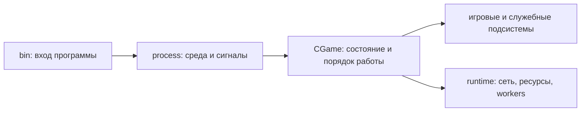

# Запуск и жизненный цикл процесса

Существующий пакет `nebokrai-server` собирает шесть программ: Auth, Login, World, Game, Billing и Misc. Он использует выделенную библиотеку `nebokrai-shared`; обе части входят в workspace [Cargo.toml](../../server/rust/Cargo.toml). Выделение Shared не меняет число процессов и их жизненный цикл.

## Зачем нужны эти слои

Файл в [src/bin/](../../server/rust/src/bin/) вызывает только соответствующую `run_*_process`. Общий [process/mod.rs](../../server/rust/src/process/mod.rs) создаёт многопоточный Tokio runtime и получает текущий рабочий каталог. Адаптер службы создаёт её runtime, передаёт запрос остановки и преобразует итог работы в код завершения.

Это позволяет менять платформенный запуск в одном месте. Последовательность игровых действий при этом остаётся в `CGame`: он определяет инициализацию, основной цикл и освобождение своих подсистем. [lib.rs](../../server/rust/src/lib.rs) подключает общий граф модулей, но каждый процесс создаёт собственные объекты.

Tokio выбран для TCP, ожиданий и сигналов. Доменные очереди и порядок их обработки остаются в службах, потому что от них зависят таймеры и результаты действий. Подробнее — [ADR-0002](../decisions/0002-semantic-boundary.md).

## Конфигурация и остановка

Процесс ищет настройки и ресурсы в **текущем рабочем каталоге**. Отдельный CLI-параметр каталога конфигурации не предусмотрен. В [Compose](../../deploy/hybrid/compose.yaml) каждой службе монтируется собственный `runtime/<служба>` в `/runtime`, который задан рабочим каталогом образа.

`SIGINT` и `SIGTERM` передают запрос завершения процессному владельцу. Освобождение ресурсов выполняется через жизненный цикл службы. Его порядок различается: например, World должен завершить сохранение до уничтожения данных, нужных DB-работникам. Полный порядок приведён в [серверных циклах](runtime-ordering.md).

World различает ошибки и остановки в `Init`, основном цикле и `Release`; [процессный адаптер](../../server/rust/src/process/worldserver.rs) выводит соответствующую причину. Эти результаты полезны при поиске места, до которого дошёл запуск.

## Где вносить изменение

| Изменение | Место |
| --- | --- |
| Общая среда запуска, сигналы ОС | [process/mod.rs](../../server/rust/src/process/mod.rs) |
| Создание runtime и сообщение об итоге конкретной службы | `process/<служба>.rs` |
| Чтение настроек, порядок Init/MainLoop/Release | `CGame` соответствующей службы |
| I/O, фоновые задачи и работа с ресурсами | Runtime и сетевые/DB-модули службы |
| Состав контейнеров, каталоги и зависимости запуска | [deploy/hybrid/](../../deploy/hybrid/) |

Целевая среда — Linux: общий вход использует Unix-сигналы. Toolchain и команды находятся в [сборке](../operations/build.md), подготовка данных — в [локальном стенде](../operations/hybrid-runtime.md).
