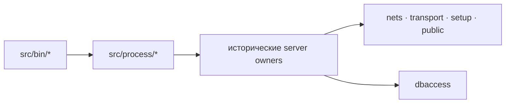

# Модель серверных процессов

[`Cargo.toml`](../../server/rust/Cargo.toml) объявляет шесть бинарников: `authserver`, `billingserver`, `gameserver`, `loginserver`, `miscserver` и `worldserver`. Каждый файл в [`src/bin/`](../../server/rust/src/bin/) только вызывает соответствующий `run_*_process` из [`src/lib.rs`](../../server/rust/src/lib.rs). Это даёт одну точку сборки модулей и оставляет владение ресурсами внутри процесса.

[`src/process/mod.rs`](../../server/rust/src/process/mod.rs) создаёт многопоточный Tokio runtime, использует текущий каталог как runtime-каталог, передаёт `SIGINT` и `SIGTERM` процессному владельцу и возвращает код завершения. Поэтому бинарник нужно запускать из каталога с его настройками и данными, а не из произвольной рабочей директории. Процессные адаптеры в `src/process/*.rs` публикуют причины отказа; детальный порядок `Init`, `MainLoop`, `Release`, сообщений и сохранения определяется соответствующим game/owner-кодом.

Разделение здесь не косметическое. Process-слой заменяет платформенный вход и сигналы, а owner-слой сохраняет подтверждённый порядок действий оригинала. Общие библиотеки выполняют инфраструктурную работу; собственные wire-форматы, таблицы, игровые правила и порядок побочных эффектов не должны меняться от такой замены. Правило проверки описано в [источниках и контрактах](../reconstruction/evidence-and-contracts.md).

Сами процессы разделены по [праву изменять состояние](../architecture/state-ownership.md). Вызов по отдельному TCP-соединению не становится требованием игровой механики лишь потому, что так работал Windows runtime; требуются доказанные данные, адресация и [порядок событий](runtime-ordering.md). До явного пересмотра Nebokrai сохраняет изученные межсерверные [wire-форматы](../protocol/transport.md). Статус архитектурной границы `PARTIAL`: разделение владельцев подтверждено оригинальными EXE/PDB и кодом, допустимость иной внутренней топологии — инженерный вывод `INFERRED`, ещё не проверенный runtime.

Наличие шести `[[bin]]` означает наличие точек входа, но не подтверждает успешный запуск всей цепочки. Например, [`process/worldserver.rs`](../../server/rust/src/process/worldserver.rs) явно различает штатное завершение и остановку на границах инициализации, основного цикла или освобождения. Текущий результат приведён в [аудите готовности](../status/audit.md).
