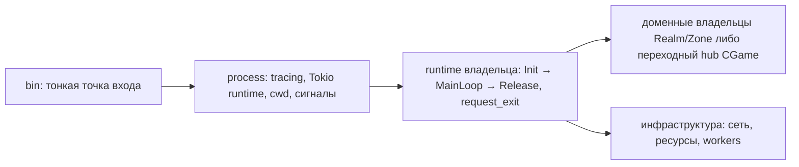

# Запуск и жизненный цикл процесса

Действующая архитектура запуска — исполняемые роли **Realm** и **Zone** поверх библиотек компонентов и общего технического слоя Shared. Каждая роль создаёт собственное состояние; её `app` выполняет композицию — создаёт компоненты, читает конфигурацию роли, поднимает сетевые края и ведёт жизненный цикл процесса, не забирая доменное состояние владельцев. Правила композиции, готовности и остановки заданы в [карте Realm и Zone](../architecture/realm-and-zone.md#8-готовность-остановка-и-отказ-процесса).

Запуск пока обслуживает переходный пакет `nebokrai-server`: он собирает **шесть тонких бинарников** исходной модели (Auth, Login, World, Game, Billing, Misc) и использует выделенные библиотеки `nebokrai-shared`, `nebokrai-realm` и `nebokrai-zone`; все части входят в workspace [Cargo.toml](../../server/rust/Cargo.toml). Это текущий способ запуска собранных ролей, а не конечная архитектура: доменный код уже в основном вынесен в библиотеки по [принятой карте](../architecture/realm-and-zone.md), а сам пакет остаётся переходным слоем процессных входов и hub-ов и растворяется по мере переноса. Ниже раздельно отмечено, что относится к действующей модели (current), к переходному запуску (transitional) и к исходной модели оригинала (historical baseline).

## Переходные входы и фактические владельцы (current)

Файл в [src/bin/](../../server/rust/src/bin/) вызывает только соответствующую `run_*_process`. Общий [process/mod.rs](../../server/rust/src/process/mod.rs) устанавливает tracing subscriber, создаёт многопоточный Tokio runtime и получает текущий рабочий каталог. Адаптер конкретной службы в `process/<служба>.rs` создаёт её runtime, передаёт запрос остановки и преобразует итог работы в код завершения. Доменные жизненные циклы этими оболочками не выполняются; фактические владельцы:

| Бинарник | Доменный жизненный цикл и владельцы | Статус |
| --- | --- | --- |
| Auth | [Realm access](../../server/rust/realm/src/access/) (`authgame.rs`) | current: домен в библиотеке |
| Login | [Realm access](../../server/rust/realm/src/access/) (`game.rs`); сетевой край — [Realm app](../../server/rust/realm/src/app/) (`login_*`) | current |
| World | [Realm app](../../server/rust/realm/src/app/): `world_game.rs`, `world_process*`, `world_runtime.rs` | current |
| Game | переходный hub [gameserver/game.rs](../../server/rust/src/gameserver/gameserver/game.rs) и [runtime.rs](../../server/rust/src/gameserver/gameserver/runtime.rs); владельцы механик — компоненты [Zone](../../server/rust/zone/src/), сетевой край — [Zone app](../../server/rust/zone/src/app/) | transitional: крупнейший остаток старого пакета |
| Billing | [Realm billing](../../server/rust/realm/src/billing/) (`game.rs`) | current |
| Misc | [Realm app](../../server/rust/realm/src/app/) (`misc_game.rs`); комната аукциона — [Realm auction](../../server/rust/realm/src/auction/) | current |

Это деление позволяет менять платформенный запуск в одном месте. Последовательность игровых действий определяет runtime владельца: он проводит цепочку `CreateGame → Init → MainLoop → Release` и хранит процессный флаг остановки. [lib.rs](../../server/rust/src/lib.rs) подключает общий граф модулей, но каждый процесс создаёт собственные объекты.

Tokio выбран для TCP, ожиданий и сигналов. Доменные очереди и порядок их обработки остаются у владельцев, потому что от них зависят таймеры и результаты действий. Подробнее — [ADR-0002](../decisions/0002-semantic-boundary.md).

## Готовность, остановка и отказ (current)

Композиция `app` роли управляет состоянием процесса и прекращением новой работы; компонент определяет собственную готовность и судьбу принятой операции; сеть — завершение I/O; persistence — сбор и DB-стадии. Один Realm объединяет область отказа пяти прежних служб: ошибка или остановка всего процесса затрагивает вход, мировой учёт, счёт и аукцион; независимое восстановление компонентов от модульности не появляется. Точный порядок общего старта/остановки выводится из зависимостей; нынешние службы освобождаются по-разному и не гарантируют доставку всей принятой работы — нельзя просто вызвать пять старых `Release` подряд и считать новый контракт установленным. Правила и открытые контракты — в [карте](../architecture/realm-and-zone.md#8-готовность-остановка-и-отказ-процесса), исполняемый порядок — в [серверных циклах](runtime-ordering.md).

## Конфигурация и остановка переходного запуска

Процесс ищет настройки и ресурсы в **текущем рабочем каталоге**. Отдельный CLI-параметр каталога конфигурации не предусмотрен. В [Compose](../../deploy/hybrid/compose.yaml) каждой службе монтируется собственный `runtime/<служба>` в `/runtime`, который задан рабочим каталогом образа.

`SIGINT` и `SIGTERM` передают запрос завершения процессному владельцу (`request_exit`). Освобождение ресурсов выполняется через жизненный цикл службы; его порядок различается: например, World должен завершить сохранение до уничтожения данных, нужных DB-работникам. Полный порядок приведён в [серверных циклах](runtime-ordering.md).

World различает ошибки и остановки в `Init`, основном цикле и `Release`; эти стадии теперь принадлежат [Realm app](../../server/rust/realm/src/app/world_process.rs), а переходный [процессный адаптер](../../server/rust/src/process/worldserver.rs) выводит соответствующую причину. Эти результаты полезны при поиске места, до которого дошёл запуск.

## Где вносить изменение

| Изменение | Место |
| --- | --- |
| Общая среда запуска, сигналы ОС | [process/mod.rs](../../server/rust/src/process/mod.rs) (переходный пакет; целевое место общих средств — `app` роли) |
| Создание runtime и сообщение об итоге конкретной службы | `process/<служба>.rs` (переходный адаптер) |
| Конфигурация роли и стадии Init/MainLoop/Release World | [Realm app](../../server/rust/realm/src/app/): `world_process_init.rs`, `world_game_init.rs`, `world_main_loop.rs`, `world_process_release.rs` |
| Жизненный цикл Login/Auth | [Realm access](../../server/rust/realm/src/access/) |
| Жизненный цикл Billing | [Realm billing](../../server/rust/realm/src/billing/) |
| Жизненный цикл Misc | [Realm app](../../server/rust/realm/src/app/) (`misc_game.rs`) |
| Основной цикл Game | переходный hub [gameserver/game.rs](../../server/rust/src/gameserver/gameserver/game.rs); новая доменная логика размещается у владельцев [Zone](../../server/rust/zone/src/), а не здесь |
| I/O, фоновые задачи и работа с ресурсами | Runtime и сетевые/DB-модули владельца; края направлений — `app` соответствующей роли |
| Состав контейнеров, каталоги и зависимости запуска | [deploy/hybrid/](../../deploy/hybrid/) |

## Исторический baseline

Исходная модель оригинала — шесть процессов (Auth, Login, World, Game, Billing, Misc), каждый со своим `CGame` и собственным состоянием. Она определила имена wire-направлений и исходные контракты жизненных циклов, которые сохраняются на клиентских и межсерверных границах совместимости; внутренним разделением нового сервера и текущей картой ownership эта модель не является — см. [Realm, Zone и Shared](../architecture/realm-and-zone.md).

Целевая среда — Linux: общий вход использует Unix-сигналы. Toolchain и команды находятся в [сборке](../operations/build.md), подготовка данных — в [локальном стенде](../operations/hybrid-runtime.md).
